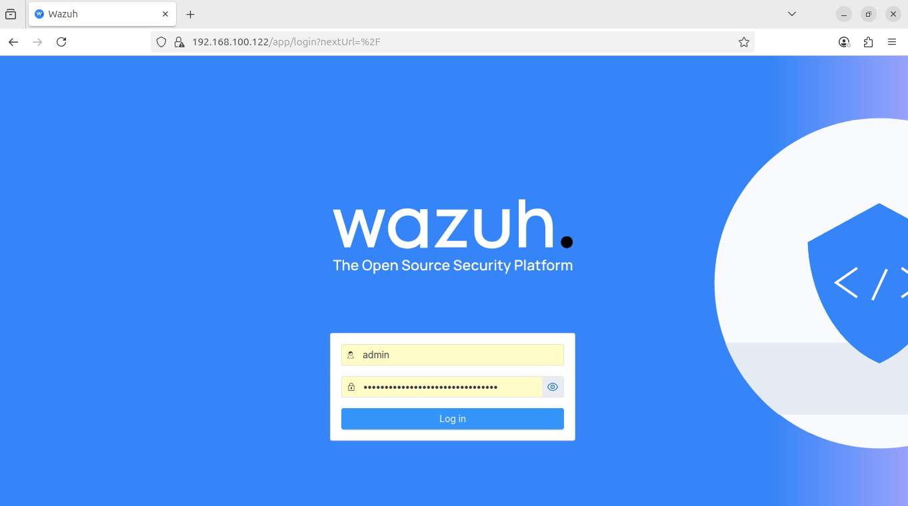

# Wazuh Lab Setup Guide

This guide provides a step-by-step process to set up a Wazuh lab environment on an **Ubuntu 22.04** machine. This setup includes the Wazuh central components and a Windows agent. We will also demonstrate how Wazuh can detect software vulnerabilities.

# Hardware Requirements for Wazuh Server (Manager & Indexer)

The hardware resources allocated to your Wazuh server components (Manager and Indexer) **highly depend on the number of protected agents (endpoints and cloud workloads)**. This estimation helps determine the volume of security data that will be analyzed and the number of alerts that need to be stored and indexed.

## Recommended Hardware Specifications

| Agents | CPU (vCPU) | RAM (GiB) | Storage (90 days) |
| :----: | :--------: | :-------: | :---------------: |
| **1 – 25** | 4 vCPU | 8 GiB | 50 GB |
| **25 – 50** | 8 vCPU | 8 GiB | 100 GB |
| **50 – 100** | 8 vCPU | 8 GiB | 200 GB |

# Installing Wazuh Central Components (Manager, Indexer, and Dashboard)

This section details the steps to download and run the Wazuh installation assistant, which sets up all necessary central components (Wazuh Manager, Wazuh Indexer, and Wazuh Dashboard) on your VM.

## 1\. Run the Installation Assistant

Use the following command to download the installation script and execute it with the `-a` (all-in-one) option. This single command handles the entire setup process.

```bash
curl -sO https://packages.wazuh.com/4.13/wazuh-install.sh && sudo bash ./wazuh-install.sh -a
```

## 2\. Review Installation Summary and Credentials

Once the assistant finishes the installation, the terminal output will provide a summary including the access credentials and a confirmation that the installation was successful.

### Example Output:

```text
INFO: --- Summary ---
INFO: You can access the web interface https://<WAZUH_DASHBOARD_IP_ADDRESS>
    User: admin    Password: <ADMIN_PASSWORD>
INFO: Installation finished.
```

You have now successfully installed and configured Wazuh\!

## 3\. Access the Wazuh Web Interface

You can access the Wazuh web interface using the provided address and credentials:

  * **URL:** `https://<WAZUH_DASHBOARD_IP_ADDRESS>`
  * **Username:** `admin`
  * **Password:** `<ADMIN_PASSWORD>` (Use the unique password shown in the summary output.)

### ⚠️ Initial Dashboard Access Warning

When you access the Wazuh dashboard for the first time, your browser will display a warning message stating that the certificate was not issued by a trusted authority.

  * **This is expected.** The installation assistant generates its own self-signed certificates for security.
  * You have the option to **accept the certificate as an exception** to proceed, or you can configure the system later to use a certificate from a public, trusted authority.

## 4\. Recovering Passwords (Optional)

The passwords for all internal Wazuh Indexer and Wazuh API users are saved securely in an archive file named `wazuh-install-files.tar`.

To print the contents of the password file at any time, run the following command:

```bash
sudo tar -O -xvf wazuh-install-files.tar wazuh-install-files/wazuh-passwords.txt
```

## 5\. Uninstalling Wazuh Central Components

If you need to completely remove the Wazuh central components, you can re-run the Wazuh installation assistant script with the uninstall option:

```bash
sudo bash ./wazuh-install.sh -u
# OR
sudo bash ./wazuh-install.sh --uninstall
```

## 5\. Access the Wazuh Dashboard

Open a web browser and navigate to https://<your_server_IP_address>. Use the credentials you saved to log in.

