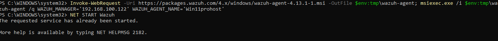
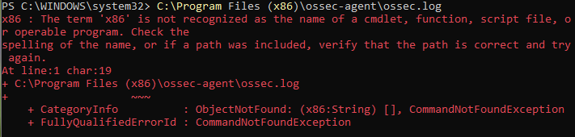
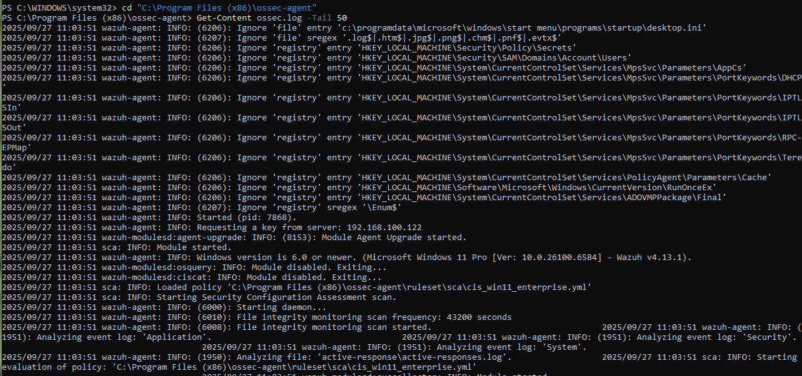
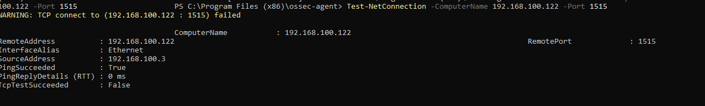
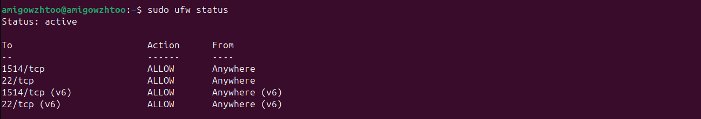
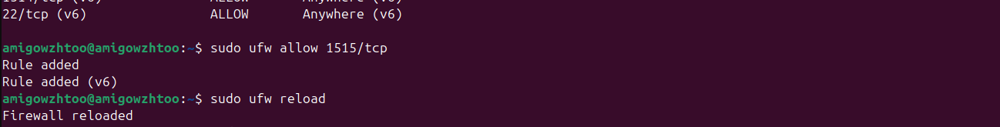
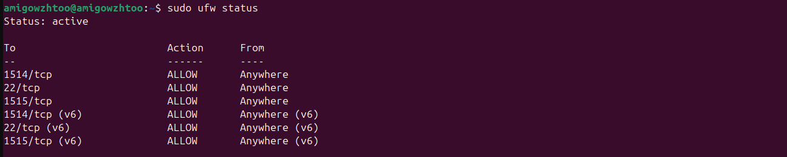
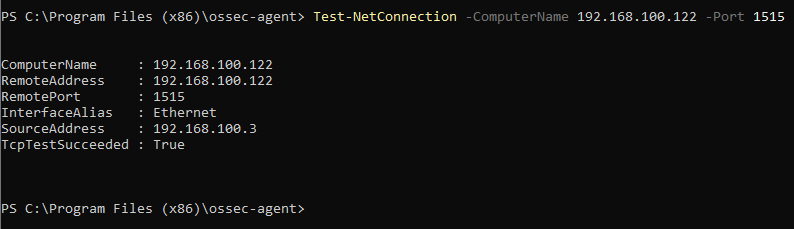

# Troubleshooting the Wazuh Agent

If you run the installation and start-up commands for the Wazuh Agent (as shown in the image), and encounter a message indicating an error or that the service is already running unexpectedly, you need to check the agent's log file for details.



## ⚠️ Common Error: Service Already Running

In the example image, the command `NET START WazuhSvc` resulted in:

```
The requested service has already been started.
```

While this specific message might simply mean the agent started automatically after installation, any unexpected error or failed connection should prompt a log review.

## Action to Take: Check the Agent Log File

The most critical step in diagnosing any agent problem (such as connection issues with the Manager, or service failure) is to check the **Wazuh Agent log file**. This file contains detailed records of the agent's startup process, connection attempts, and configuration errors.

To check the logs, navigate to the agent's installation directory and open the log file:

```powershell
C:\Program Files (x86)\ossec-agent\ossec.log
```


**What to look for in the log:**

  * **Connection Errors:** Check for messages like `Could not connect to the manager` or `Connection refused`.
  * **Configuration Issues:** Look for entries about invalid IP addresses, mismatched keys, or other configuration warnings.
  * **Successful Connection:** If the agent is running correctly, you should see messages confirming a successful connection to the Wazuh Manager's IP (`192.168.100.122` in your example).

# Correcting the Error: How to View the Log File in PowerShell

The error shown in your image occurs because you tried to execute the log file path (`C:\Program Files (x86)\ossec-agent\ossec.log`) as a command, but PowerShell only saw the first part (`C:\Program Files (x86)\ossec-agent\ossec.log`) and didn't recognize it as an operable program.

To correctly read the content of a file in PowerShell, you must use the **`Get-Content`** cmdlet.

Here are the correct ways to read the last 50 lines of the `ossec.log` file, which is the best practice for troubleshooting:

## Solution: Direct Path with `Get-Content`

Use this command to read the log file from any directory in your terminal. This is the simplest method.

```powershell
Get-Content "C:\Program Files (x86)\ossec-agent\ossec.log" -Tail 50
```
These methods will correctly display the log file, allowing you to troubleshoot any issues with the Wazuh Agent.



```powershell
Test-NetConnection -ComputerName 192.168.100.122 -Port 1515
```


# Troubleshooting Error: Agent Connection Failure

## Firewall Rules

If the Ubuntu firewall (UFW/iptables) does not allow inbound traffic on port **1515**, the agent will not be able to connect.  

**Check the firewall status on Ubuntu:**

```bash
sudo ufw status
```



If port `1515/tcp` is not allowed, add it:

```bash
sudo ufw allow 1515/tcp
```


```bash
sudo ufw allow reload
sudo ufw status
```


## Test Connection from Windows Agent

After configuring the firewall, try testing the connection from the Windows agent again:

```powershell
Test-NetConnection -ComputerName 192.168.100.122 -Port 1515
```

If the result shows `TcpTestSucceeded : True`, the agent should be able to connect to the enrollment service.




## Final Step

**Refresh your Wazuh deskboard**

Finally, it’s a success!

Happy 