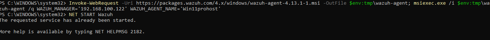
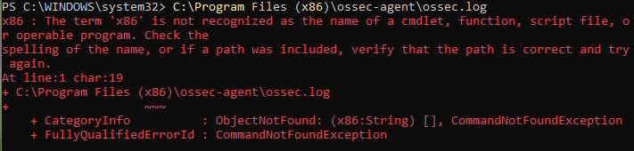
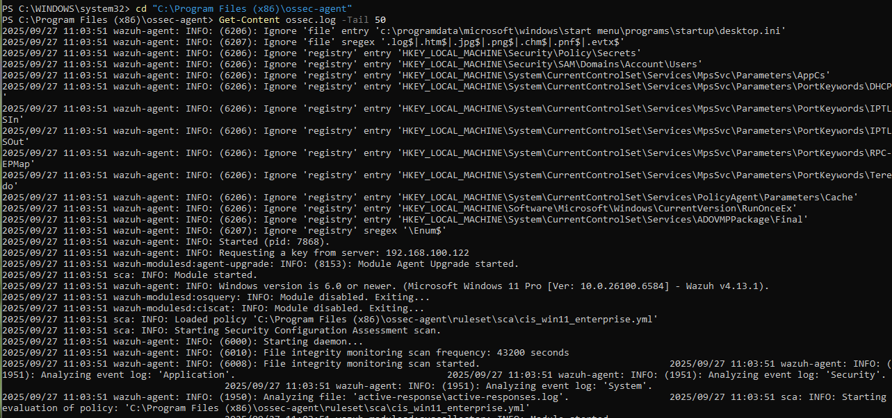
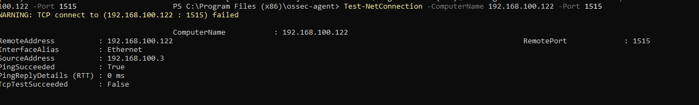
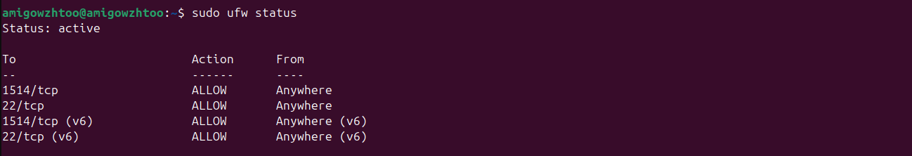
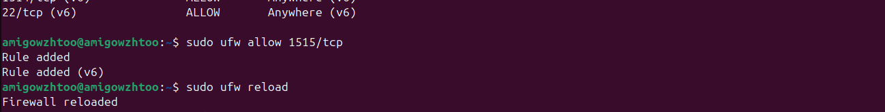
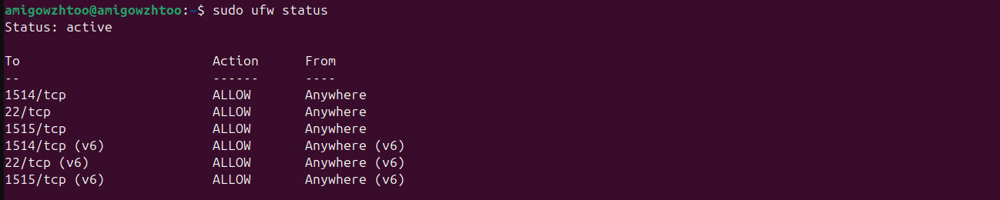
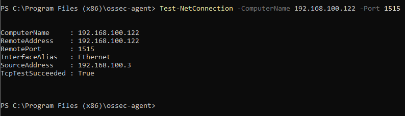

# Troubleshooting the Wazuh Agent

If you run the installation and start-up commands for the Wazuh Agent (as shown in the image), and encounter a message indicating an error or that the service is already running unexpectedly, you need to check the agent's log file for details.



## ⚠️ Common Error: Service Already Running

In the example image, the command `NET START WazuhSvc` resulted in:

```
The requested service has already been started.
```

While this specific message might simply mean the agent started automatically after installation, any unexpected error or failed connection should prompt a log review.

## Action to Take: Check the Agent Log File

The most critical step in diagnosing any agent problem (such as connection issues with the Manager, or service failure) is to check the **Wazuh Agent log file**. This file contains detailed records of the agent's startup process, connection attempts, and configuration errors.

To check the logs, navigate to the agent's installation directory and open the log file:

```powershell
C:\Program Files (x86)\ossec-agent\ossec.log
```


**What to look for in the log:**

  * **Connection Errors:** Check for messages like `Could not connect to the manager` or `Connection refused`.
  * **Configuration Issues:** Look for entries about invalid IP addresses, mismatched keys, or other configuration warnings.
  * **Successful Connection:** If the agent is running correctly, you should see messages confirming a successful connection to the Wazuh Manager's IP (`192.168.100.122` in your example).

# Correcting the Error: How to View the Log File in PowerShell

The error shown in your image occurs because you tried to execute the log file path (`C:\Program Files (x86)\ossec-agent\ossec.log`) as a command, but PowerShell only saw the first part (`C:\Program Files (x86)\ossec-agent\ossec.log`) and didn't recognize it as an operable program.

To correctly read the content of a file in PowerShell, you must use the **`Get-Content`** cmdlet.

Here are the correct ways to read the last 50 lines of the `ossec.log` file, which is the best practice for troubleshooting:

## Solution: Direct Path with `Get-Content`

Use this command to read the log file from any directory in your terminal. This is the simplest method.

```powershell
Get-Content "C:\Program Files (x86)\ossec-agent\ossec.log" -Tail 50
```
These methods will correctly display the log file, allowing you to troubleshoot any issues with the Wazuh Agent.



```powershell
Test-NetConnection -ComputerName 192.168.100.122 -Port 1515
```


# Troubleshooting Error: Agent Connection Failure

## Firewall Rules

If the Ubuntu firewall (UFW/iptables) does not allow inbound traffic on port **1515**, the agent will not be able to connect.  

**Check the firewall status on Ubuntu:**

```bash
sudo ufw status
```



If port `1515/tcp` is not allowed, add it:

```bash
sudo ufw allow 1515/tcp
```


```bash
sudo ufw allow reload
sudo ufw status
```


## Test Connection from Windows Agent

After configuring the firewall, try testing the connection from the Windows agent again:

```powershell
Test-NetConnection -ComputerName 192.168.100.122 -Port 1515
```

If the result shows `TcpTestSucceeded : True`, the agent should be able to connect to the enrollment service.




## Final Step

**Refresh your Wazuh deskboard**

Finally, it’s a success!

Happy 

## Disconnected agents အဟောင်းတွေ ဖျက်ချင်ရင် အောက်ပါနည်းလမ်းတွေနဲ့ လုပ်ဆောင်နိုင်ပါတယ်။

## Wazuh Docker မှာ Disconnected Agents များ ဖျက်နည်း

### **Command Breakdown**

```bash
sudo docker ps --format "table {{.Names}}\t{{.Status}}"
```

#### အပိုင်း (၁): `sudo`
- **အဓိပ္ပာယ်**: Super User Do (root privileges)
- **လုပ်ဆောင်ချက်**: Docker commands ကို run ဖို့ **administrator ခွင့်ပြုချက်** ယူပါတယ်

#### အပိုင်း (၂): `docker ps`
- **အဓိပ္ပာယ်**: Docker Process Status
- **လုပ်ဆောင်ချက်**: **လက်ရှိ run နေတဲ့ Docker containers** တွေရဲ့ list ကို ပြပေးပါတယ်

#### အပိုင်း (၃): `--format "table ..."`
- **အဓိပ္ပာယ်**: Output format ကို customize လုပ်ဖို့
- **လုပ်ဆောင်ချက်**: Table format နဲ့ ဘယ်အချက်အလက်တွေကို ပြမယ်ဆိုတာ သတ်မှတ်ပါတယ်

#### အပိုင်း (၄): `{{.Names}}\t{{.Status}}`
- **`{{.Names}}`**: Container ရဲ့ **နာမည်** ကို ပြပါမယ်
- **`\t`**: Tab space (ကော်လံတွေ ခြားဖို့)
- **`{{.Status}}`**: Container ရဲ့ **လက်ရှိအခြေအနေ** ကို ပြပါမယ်
  - ဥပမာ: "Up 5 minutes", "Exited (0) 2 days ago"

---

### **မြင်ရမယ့် Output Format**

ဒီ command run ရင် ဒီလိုမျိုး table format နဲ့ မြင်ရပါလိမ့်မယ်:

```
NAMES               STATUS
wazuh.manager       Up 2 hours
wazuh.indexer       Up 2 hours  
wazuh.dashboard     Up 2 hours
mysql-container     Up 1 day
nginx-proxy         Up 3 days
```

---

### 💡 **ဒီ command ရဲ့ အကျိုးကျေးဇူးများ**

1. **အချက်အလက် စုစည်းမှု**: Container names နဲ့ status တွေကို တစ်ပြိုင်နက် မြင်ရမယ်
2. **ရိုးရှင်းမှု**: Default `docker ps` output ထက် ပိုရှင်းတယ်
3. **Quick monitoring**: Containers တွေ run နေလား၊ stop ဖြစ်နေလားဆိုတာ အမြန်ကြည့်လို့ရတယ်
---

### **နမူနာအသုံးပြုပုံများ**

```bash
# ပုံမှန် docker ps (default output)
sudo docker ps

# Custom format - names and status only  
sudo docker ps --format "table {{.Names}}\t{{.Status}}"

# Custom format - names, status, and ports
sudo docker ps --format "table {{.Names}}\t{{.Status}}\t{{.Ports}}"

# Custom format - names, image, and created time
sudo docker ps --format "table {{.Names}}\t{{.Image}}\t{{.CreatedAt}}"
```
**ဒီ command ကို Wazuh Docker environment မှာ run ကြည့်ရင် containers ၃ ခု (manager, indexer, dashboard) ရဲ့ status တွေ မြင်ရပါလိမ့်မယ်။**

#### **အဆင့် ၁: Wazuh Manager Container ထဲကို ဝင်ပါ**
```bash
sudo docker exec -it single-node_wazuh.manager_1 bash
```

#### **အဆင့် ၂: Agent List ကြည့်ပါ**
```bash
/var/ossec/bin/agent_control -l
```

ရလဒ်က ဒီလိုမျိုးပါ:
```bash
❯ sudo docker exec -it single-node_wazuh.manager_1 bash
[sudo] password for amigowzhtoo: 
bash-5.2# /var/ossec/bin/agent_control -l

Wazuh agent_control. List of available agents:
   ID: 000, Name: wazuh.manager (server), IP: 127.0.0.1, Active/Local
   ID: 001, Name: Win11prohost, IP: any, Active
   ID: 002, Name: Ubuntu_winzawhtoo, IP: any, Active
   ID: 003, Name: Kali_VBox, IP: any, Disconnected
   ID: 004, Name: kali, IP: any, Disconnected
   ID: 005, Name: Kali_VMware, IP: any, Disconnected

List of agentless devices:

bash-5.2#
```
## **တစ်ခုချင်းစီ ဖျက်ကြည့်ရအောင်**

### **အဆင့် ၁: Agent 003 ကို အရင်ဖျက်ပါ**

```bash
echo "y" | /var/ossec/bin/manage_agents -r 003
```

### **အဆင့် ၂: Agent 004 ကို ဖျက်ပါ**

```bash
echo "y" | /var/ossec/bin/manage_agents -r 004
```

### **အဆင့် ၃: Agent 005 ကို ဖျက်ပါ**

```bash
echo "y" | /var/ossec/bin/manage_agents -r 005
```

## ဖျက်ပြီးနောက် စစ်ဆေးပါ

```bash
/var/ossec/bin/agent_control -l
```

ဒီလိုမျိုး မြင်ရပါလိမ့်မယ်:
```
Wazuh agent_control. List of available agents:
   ID: 000, Name: wazuh.manager (server), IP: 127.0.0.1, Active/Local
   ID: 001, Name: Win11prohost, IP: any, Active
   ID: 002, Name: Ubuntu_winzawhtoo, IP: any, Active

List of agentless devices:
```
## Alternative Method: Script သုံးပါ

တစ်ခါတည်း ဖျက်ချင်ရင် ဒီ script ကို သုံးပါ:

```bash
for agent_id in 003 004 005; do
    echo "Deleting agent ID: $agent_id"
    echo "y" | /var/ossec/bin/manage_agents -r $agent_id
done
```