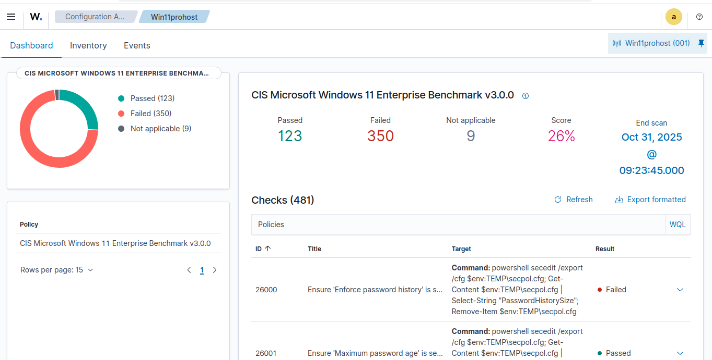
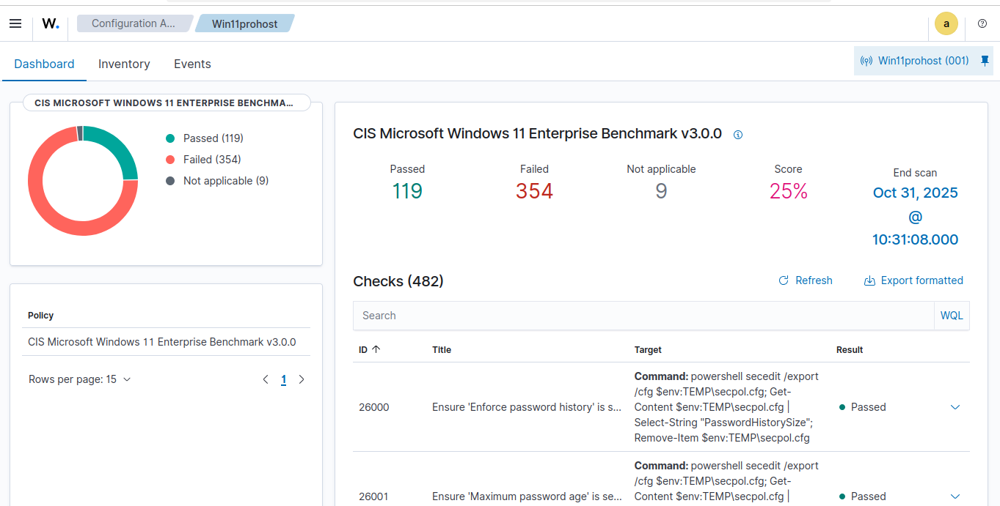

## CIS Score (Configuration Assessment Score) for your **Win11prohost** agent from the Wazuh Dashboard.


### How to View the CIS Score for Win11prohost

To view the CIS Score, you need to navigate to the **Configuration Assessment** module within the **Modules** section of the Wazuh Dashboard.

#### Step 1:  Go to the Modules Section

1.  Open your **Wazuh Dashboard**.
2.  On the left-hand sidebar, click on **`Modules`**.
3.  From the list of modules, find and select **`Configuration Assessment`**.

#### Step 2: Select the Policies View

1.  Inside the **Configuration Assessment** page, look for and click on the **`Policies`** or **`Policies summary`** tab.
2.  Here, you will see a list of security policies that your agents are being checked against. Find and click on the policy named **`CIS Microsoft Windows 11 Enterprise Benchmark v3.0.0`**.

#### Step 3: View the Agent Score

1.  After clicking on the policy, you will be taken to a detailed page for it.
2.  This page includes a list of **Agents** and their compliance status for this specific policy.
3.  Look for **`Win11prohost`** in this list. You will be able to see its current **`Score`** (which was previously at 26%).

---

### 📌 Important Recommendation (Perform a Restart)

Once you have successfully upgraded the agent, it is a very good idea to perform a **restart** of the **Win11prohost** machine.

This will ensure the upgraded agent loads its new configuration correctly and can begin a fresh CIS scan more efficiently.


# **CIS Score** for **Win11prohost** after the upgrade.


### Current CIS Score Status (Update)

**Win11prohost** against the **CIS Microsoft Windows 11 Enterprise Benchmark v3.0.0**.

| Item | Previous (Before Upgrade) | Current (After Upgrade) | Difference |
| :--- | :--- | :--- | :--- |
| **Score** | **26%** | **26%** | No Change |
| **Passed Checks** | **124** | **123** | Decreased by 1 |
| **Failed Checks** | **352** | **350** | Decreased by 2 |
| **Not Applicable** | **5** | **9** | Increased by 4 |
| **End Scan** | Oct 30, 2025 @ 21:26:48.000 | **Oct 31, 2025 @ 09:23:45.000** | A new scan has completed |

#### Interpretation

This confirms that after the agent upgrade, a **new CIS scan** automatically ran and completed at **Oct 31, 2025 @ 09:23:45.000**.

*   While the **Score** itself has not changed yet, the fact that **Failed Checks decreased by 2** and **Not Applicable checks increased by 4** indicates that the **upgraded agent** is now assessing the system's configuration more accurately. This is a positive sign of normalization after the update.

---

###  The Final Step for System Hardening

Now that the entire system is stable and operational, we can focus on the ultimate goal: improving your security posture by increasing the **CIS Score (26%)**.

Let's begin the crucial process of **system hardening** for your **Win11prohost** machine by addressing the **350 failed checks** in the CIS Benchmark. This will systematically enhance your machine's security to meet industry standards.

### 🛠️ Starting CIS Failed Checks Remediation

We will start with the **Password Policy** category, which contains some of the most **critical and easiest** checks to fix. Addressing these will immediately begin to improve your **CIS Score (26%)**.

#### Priority Checks to Remediate (Password Policy)

Based on your CIS Dashboard, we will start with the following three checks.

| ID | Title | Result | What Needs to be Fixed |
| :--- | :--- | :--- | :--- |
| **26000** | Ensure 'Enforce password history' is... | **Failed** | Configure the system to **remember old passwords** and prevent reuse. |
| **26002** | Ensure 'Minimum password age' is... | **Failed** | Set a **minimum time period** that a password must be used before it can be changed again. |
| **26003** | Ensure 'Minimum password length' is... | **Failed** | Enforce a **minimum number of characters** for user passwords. |

-----

### Steps to Fix Password Policy (On Win11prohost)

These changes will be made using the **Local Group Policy Editor** on the **Win11prohost** machine itself.

#### Step 1: Open the Local Security Policy Editor

1.  On the **Win11prohost** machine, press the **Windows Key + R** to open the Run dialog.
2.  Type **`secpol.msc`** and press Enter. (The Local Security Policy editor will open).

#### Step 2: Configure the Password Policies

In the left-hand tree view, navigate to:
**`Security Settings`** $\rightarrow$ **`Account Policies`** $\rightarrow$ **`Password Policy`**

1.  **Remediate Rule ID 26000 (Enforce password history)**
    *   Double-click on **`Enforce password history`**.
    *   Change the value to **`24` passwords remembered** (This is the CIS-recommended standard).
    *   Click **Apply** and then **OK**.

2.  **Remediate Rule ID 26003 (Minimum password length)**
    *   Double-click on **`Minimum password length`**.
    *   Change the value to **`14` characters** (This is the CIS-recommended standard).
    *   Click **Apply** and then **OK**.

3.  **Remediate Rule ID 26002 (Minimum password age)**
    *   Double-click on **`Minimum password age`**.
    *   Change the value to **`1` day** (This prevents users from immediately changing their password 24 times to revert to an old one).
    *   Click **Apply** and then **OK**.

#### Step 3: Force a Group Policy Update

After making these changes, you must force the policy to apply immediately.
1.  Open **Command Prompt as Administrator**.
2.  Run the following command:

```cmd
gpupdate /force
```

-----


# **CIS Score** and enhance the completeness of security logs from **Win11prohost** by configuring the **Audit Policies**.

 This is a crucial step for improving visibility into security events on your system.

### Steps to Configure Audit Policies (Enhancing Logging)

Configuring these policies will allow the Wazuh agent to capture a more comprehensive set of important security events occurring on **Win11prohost**.

#### Step 1: Open the Local Security Policy Editor

1.  On the **Win11prohost** machine, press **Windows Key + R** to open the Run dialog.
2.  Type **`secpol.msc`** and press Enter.

#### Step 2: Configure Audit Policy (Rule ID 26055)

This policy forces Windows to use more granular **subcategory policy settings**, which is required for precise auditing as per the CIS standard.

1.  Navigate to: **`Security Settings`** $\rightarrow$ **`Local Policies`** $\rightarrow$ **`Security Options`**.
2.  Find the policy named: **`Audit: Force audit policy subcategory settings (Windows Vista or later) to override audit policy category settings`**.
3.  Double-click it, select **`Enabled`**, and click **Apply** and then **OK**.

#### Step 3: Configure Audit Filtering Platform Connection (Rule ID 18260)

This policy ensures detailed logging of connections allowed or blocked by the Windows Firewall, which is vital for network security monitoring.

1.  Navigate to: **`Security Settings`** $\rightarrow$ **`Advanced Audit Policy Configuration`** $\rightarrow$ **`System Audit Policies - Local Group Policy Object`** $\rightarrow$ **`Object Access`**.
2.  Find the policy named: **`Audit Filtering Platform Connection`**.
3.  Double-click it.
4.  In the properties window, check the box for **`Configure the following audit events:`**.
5.  Then, check both **`Success`** and **`Failure`** below it.
6.  Click **Apply** and then **OK**.

#### Step 4: Force a Group Policy Update

After making these changes, you must force the policy to apply immediately.
1.  Open **Command Prompt as Administrator**.
2.  Run the following command:

```cmd
gpupdate /force
```

-----

### 🛑 CIS Score UAC Policy



After you restarted the agent from the Dashboard, the latest scan result (Oct 31, 2025 @ 10:22:28.000) confirms that the **CIS Score** has remained at **24%**, and the number of **Failed Checks (355)** is unchanged.

| Item | Previous (Scan 5) | Current (Scan 6) | Difference |
| :--- | :--- | :--- | :--- |
| **End Scan Time** | 10:07:52.000 | **10:22:28.000** | New Scan Completed |
| **Score** | **24%** | **24%** | No Change |
| **Failed Checks** | **355** | **355** | No Change |

#### Core Issue (Audit Policy Conflict)

While our policy configurations are confirmed to be active on the system (the `auditpol` command verified this), the CIS Scan continues to report them as **Failed**. This indicates that the **CIS assessment engine** is not correctly reading these settings, possibly due to a **policy precedence conflict** (e.g., a Group Policy Object from a domain might be overriding the local policy) or a specific interpretation issue with the scanner.

To definitively push the score upward, we will now target a different, highly critical set of **Failed Checks** related to **Registry-based User Account Control (UAC)** policies. Addressing these is very likely to result in a visible score increase.

---

### Remediating More Failed Checks (User Account Control)

We will now configure some of the most important security settings in the CIS benchmark: **User Account Control (UAC)** policies. Having UAC disabled or misconfigured poses a significant security risk.

#### Priority Checks to Remediate (UAC Policy)

| ID | Title | What Needs to be Fixed |
| :--- | :--- | :--- |
| **26132** | Ensure 'User Account Control: Behavior of the elevation prompt for administrators in Admin Approval Mode' is set to... | Set to **'Prompt for consent on the secure desktop'**. This forces a secure prompt for all admin actions. |
| **26139** | Ensure 'User Account Control: Detect application installations and prompt for elevation' is set to... | Set to **'Enabled'**. This ensures permission is required for installing applications. |
| **26140** | Ensure 'User Account Control: Only elevate executables that are signed and validated' is set to... | Set to **'Enabled'**. This ensures only digitally signed and trusted programs can run with elevated privileges. |

#### Steps to Fix UAC Policies (On Win11prohost)

1.  On the **Win11prohost** machine, press **Windows Key + R**, type **`secpol.msc`**, and press Enter.
2.  Navigate to: **`Security Settings`** $\rightarrow$ **`Local Policies`** $\rightarrow$ **`Security Options`**.
3.  Find and configure the following three policies to match the CIS standard:

*   Find **`User Account Control: Behavior of the elevation prompt for administrators in Admin Approval Mode`**.
    *   Double-click it and set it to **`Prompt for consent on the secure desktop`**.
*   Find **`User Account Control: Detect application installations and prompt for elevation`**.
    *   Double-click it and set it to **`Enabled`**.
*   Find **`User Account Control: Only elevate executables that are signed and validated`**.
    *   Double-click it and set it to **`Enabled`**.

4.  After configuring all three, open **Command Prompt as Administrator** and run:

```cmd
gpupdate /force
```
